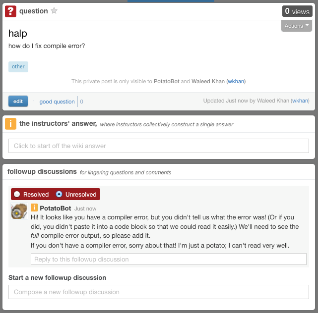

# About

Ever use [Piazza][piazza]? You might get a lot of repetitive questions for which you'd
like to give the same advice, or point to the same resources, or so on.

  [piazza]: https://piazza.com/

PotatoBot is a Piazza bot which automatically responds to questions!



It's written for [the computer science courses at University of Michigan][eecs].

  [eecs]: http://eecs.umich.edu/

# Installation

PotatoBot is written for Python 3.

To launch PotatoBot, launch a PotatoBot profile with Python:

```
python profile281.py  # For EECS 281 at UM.
```

You will want to set the following environment variables:

  * `PBOT_EMAIL`: The email address of the PotatoBot account. (The PotatoBot
    account should be an instructor for maximum effectiveness, so that it can
repsond to private posts.)
  * `PBOT_PASSWORD`: The password for the account.
  * `PBOT_CLASS_CODE`: The class code on Piazza. You can find this in the Piazza
    URL. It may look something like this: `iiw12cde6ghij`

# Usage

See `profile.py` for an example.

# License

PotatoBot is licensed under GPL v2. Additionally, when used for University of
Michigan Piazza courses, please use the university PotatoBot account.
